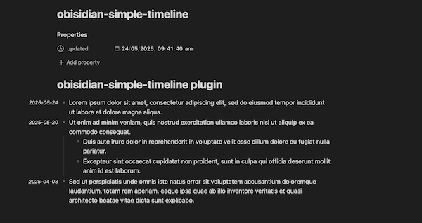

# Obsidian Simple Timeline

Display a list of dates and times as a timeline in Obisidian.



## Usage

This plugin will look for text formatted in one of the following ways:

```
- YYYY-MM-DD: <Any text>
- YYYY-MM-DD MM:SS: <Any text>
```

No other date/time formats are currently supported (feel free to open an Issue or PR though).

Any matching text will be styled with the CSS class `.ost-date`. In Reading Mode the date/time will be displayed to
the left of the document.

## Development

### Deploying

- Update version in package.json, manifest.json, and versions.json
- Create release in Github
- Build app and attach `main.js`, `styles.css`, and `manifest.json` to release.

### Developing locally

1. `npm run dev`
2. `mv ~/Obsidian/Personal/.obsidian/plugins/obsidian-simple-timeline/main.js ~/Obsidian/Personal/.obsidian/plugins/obsidian-simple-timeline/main.js.bak`
3. `mv ~/Obsidian/Personal/.obsidian/plugins/obsidian-simple-timeline/manifest.json ~/Obsidian/Personal/.obsidian/plugins/obsidian-simple-timeline/manifest.json.bak`
4. `mv  ~/Obsidian/Personal/.obsidian/plugins/obsidian-simple-timeline/styles.css ~/Obsidian/Personal/.obsidian/plugins/obsidian-simple-timeline/styles.css.bak`
5. `ln -s ~/Documents/Development/obsidian-simple-timeline/main.js ~/Obsidian/Personal/.obsidian/plugins/obsidian-simple-timeline/main.js`
6. `ln -s ~/Documents/Development/obsidian-simple-timeline/manifest.json ~/Obsidian/Personal/.obsidian/plugins/obsidian-simple-timeline/manifest.json`
7. `ln -s ~/Documents/Development/obsidian-simple-timeline/styles.css ~/Obsidian/Personal/.obsidian/plugins/obsidian-simple-timeline/styles.css`
8. Reload plugin in Obsidian

To revert:

1. `rm ~/Obsidian/Personal/.obsidian/plugins/obsidian-simple-timeline/main.js`
2. `rm ~/Obsidian/Personal/.obsidian/plugins/obsidian-simple-timeline/manifest.json`
3. `rm ~/Obsidian/Personal/.obsidian/plugins/obsidian-simple-timeline/styles.css`
4. `mv ~/Obsidian/Personal/.obsidian/plugins/obsidian-simple-timeline/main.js.bak ~/Obsidian/Personal/.obsidian/plugins/obsidian-simple-timeline/main.js`
5. `mv ~/Obsidian/Personal/.obsidian/plugins/obsidian-simple-timeline/manifest.json.bak ~/Obsidian/Personal/.obsidian/plugins/obsidian-simple-timeline/manifest.json`
6. `mv ~/Obsidian/Personal/.obsidian/plugins/obsidian-simple-timeline/styles.css.bak ~/Obsidian/Personal/.obsidian/plugins/obsidian-simple-timeline/styles.css`
